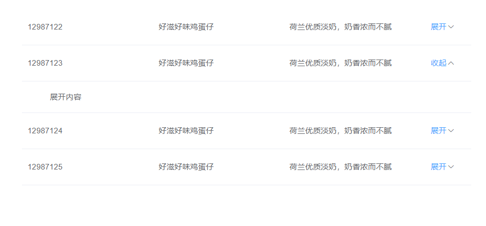

# element-table-expand扩展示例

### 基于emelemt-ui的表格的样式修改

### 效果预览



### 实现功能
- [x] **替换默认展开图标**


## Project setup
```
npm install
```

### Compiles and hot-reloads for development
```
npm run serve
```

### Compiles and minifies for production
```
npm run build
```

### Run your tests
```
npm run test
```

### Lints and fixes files
```
npm run lint
```

### Customize configuration
See [Configuration Reference](https://cli.vuejs.org/config/).
